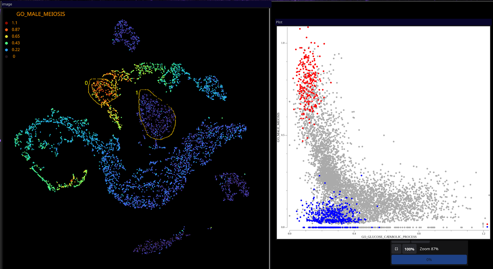

# Single-Cell Signature Explorer

see also this [page](https://sites.google.com/site/fredsoftwares/products/single-cell-signature-explorer)

Single-Cell Signature Explorer is a package of four softwares dedicated to high throughput signature exploration in single-cell RNAseq analysis. Single-Cell Signature Explorer  is fully compatible with [Single-Cell  Virtual  Cytometer](https://sites.google.com/u/0/d/1xKJ0wBSr69I8lvvRqGGPlH0U5YtTZJ8_/p/1nQfeSUAxIUnuNmmKembxlpgg4dnT5bpu/preview) and [Single-cell Multilayer Viewer](https://sites.google.com/u/0/d/1xKJ0wBSr69I8lvvRqGGPlH0U5YtTZJ8_/p/1Fa7npFgAtOL7EKl0-Juti9hs9Htd9XFm/preview) .

 A video how to use this set of softwares is available as supplemental data in Nucleic Acid Research website.  How to install softwares and packages to use the Viewer & Combiner on windows is now available on [youtube](https://youtu.be/cnFc_NJBfzo). Please note that this video covers the installation of R, Rstudio, Rtools, that are not supported by us.

Single-Cell Signature Explorer is directly compatible with [Single-Cell  Virtual  Cytometer](https://sites.google.com/u/0/d/1xKJ0wBSr69I8lvvRqGGPlH0U5YtTZJ8_/p/1nQfeSUAxIUnuNmmKembxlpgg4dnT5bpu/preview) , [Single-cell Multilayer Viewer](https://sites.google.com/u/0/d/1xKJ0wBSr69I8lvvRqGGPlH0U5YtTZJ8_/p/1Fa7npFgAtOL7EKl0-Juti9hs9Htd9XFm/preview) and [Single-Cell Spatial Explorer](https://github.com/FredPont/spatial) .

# Pipeline

Single-Cell Signature Scorer computes for each cell a signature score.

Single-Cell Signature Merger collates the signature scores table with t-SNE/UMAP/other coordinates.

Single-Cell Signature Viewer displays signatures scores on a t-SNE/UMAP/other map.

Single-Cell Signature Combiner displays the combination of two signatures scores on a t-SNE/UMAP/other map.

If you enjoy using Single-Cell Signature Explorer and find it useful, then please cite Fred'Softwares address and "Single-Cell Signature Explorer for comprehensive visualization of single cell signatures across scRNA-seq datasets. Nucleic Acids Research, gkz601, https://doi.org/10.1093/nar/gkz601"

# Features 
+ High throughput scores computation (see fig 2-3)

+ Scores can be computed on a basic computer or a supercomputer as well (see benchmark fig 2 and 3)

+ Work out of the box : no installation for the scorer and the merger developed using a high performance compiled programming language.

+ Conda environment  and [video](https://www.youtube.com/watch?v=cnFc_NJBfzo) for easy installation of the Viewer/Combiner

+ No complex command lines : copy the data and start the software

+ Already automated for thousands of pathways 

+ Ready to use pathway [database](https://sites.google.com/site/fredsoftwares/products/databases) with >35,000 human pathways

+ Easy use of custom pathways (see doc)

+ Can distinguish inhibitor/activator genes in custom pathways (see doc)

+ No data alteration : the user can use the latest normalization/noise reduction algorithm during data pre-processing

+ Scores manually validated and heavily tested by experienced biologists/immunologists on a large amount of data using antibodies, purified cells. (see publication supp data)

+ Step-by-step documentation of 17 pages, continuously improved to cover the user's questions. 

Figure 1.  KEGG Signature "Antigen Processing and Presentation" (89 genes) displayed on a t-SNE plot of 13,500 human peripheral blood mononuclear cells by Single-Cell Signature Viewer.

Figure 2. In this benchmark, Single Cell Signature Scorer achieve 8 million scores / min on a dual Xeon Gold CPU. The new low memory scorer is almost as fast (6.74 million scores / min) and consume less than 3 Go RAM.

Figure 3.  Single Cell Signature Explorer (in red SCSE) computes enrichment score at very high throughput (A) and low memory usage (B) while maintaining a good concordance with competitors.  (Noureen et al. eLife 2022;11:e71994.  DOI: https://​doi.​org/​10.​7554/​eLife.​71994)

Figure 4. Single-Cell Signature Explorer is compatible with [Single-Cell Spatial Explorer](https://github.com/FredPont/spatial). For an easier coordinates to pixel position conversion you can use [Spatial Background Builder](https://github.com/FredPont/Spatial_Background_Builder) .

# Known issues
1- In some versions of shiny R package (used by the viewer and the combiner) the following error can occur : Listening on http://127.0.0.1:5405 Error in utils::browseURL(appUrl) : ’browser’ must be a non-empty character string.

Solution :

in R session specify the web browser name with the command :

options(browser = 'firefox') 

or 

options(browser = ”firefox”)  (in some version simple quotes are required, in other double quotes)

and restart the viewer with :

source("Run.R")

if the previous solution fails, then a non interactive session must be used, in a terminal type :

 Rscript Run.R

and then open the URL manually in the web browser

2- The maximum number of item that a drop down list can display is limited. This limit is dependent on the browser, and browser version.  For example in Firefox a large list can disappears.  In this case, try to use google chrome or split the table. This can be done using some tools in this website, for example ”Select columns in table”.

3- In some linux distributions the Cairo R pakcage, used by the viewer/combiner, is difficult to install. A solution in this post . We recommend to use the conda environment available in the software zip archive to install the needed R packages automatically. 